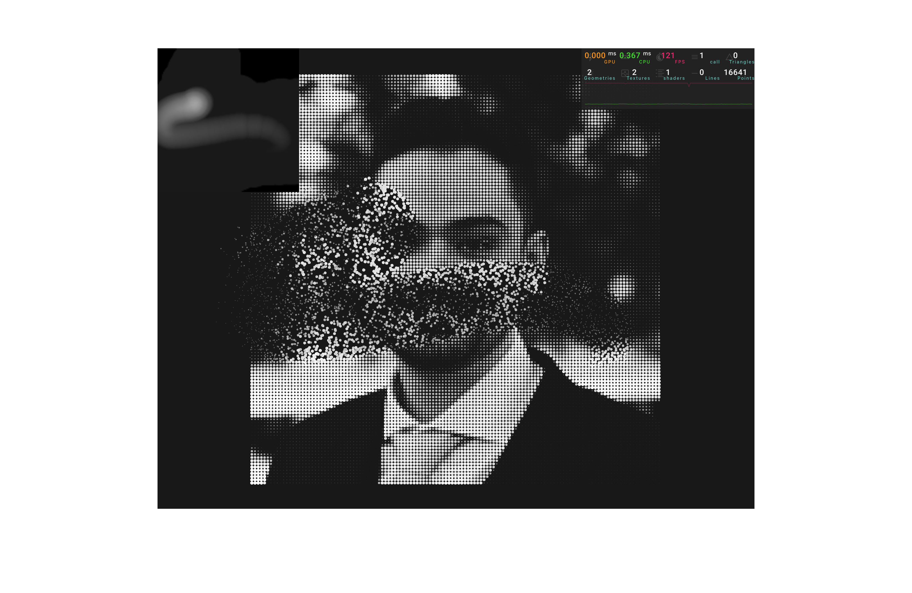

 # [Particles-Cursor-Animation](https://particles-cursor-animation.kyledlong.com/)

This project showcases WebGL shaders implemented using React Three Fiber (R3F). 

# Particles Cursor Animation

This project demonstrates an interactive particle system that responds to mouse movement using WebGL shaders and React Three Fiber. The application features a 2D canvas overlay that captures cursor interactions and translates them into a 3D particle field, where particles dynamically resize and animate based on the cursor's position over an invisible plane. The system uses raycasting to convert 3D mouse coordinates to 2D canvas coordinates, which are then used as a texture to drive particle behaviour in custom vertex and fragment shader, creating a seamless bridge between 2D cursor input and 3D visual effects.

<br>



## Tech

|                   |               |
| ----------------- | ------------- |
| React Three Fiber | WebGL         |
| JS                | Three.js      |
| HTML              | CSS           |
| Vite              | shaders       |


## How to Use
<br>

1. Clone the repository:

```bash
git clone https://github.com/KD-Long/Particles-Cursor-Animation.git
```

2. Install the dependencies:

```bash
cd Particles-Cursor-Animation
npm install
```

3. Run the project:

```bash
npm run dev
```

3. Open your web browser and navigate to http://localhost:5173 to access the project.